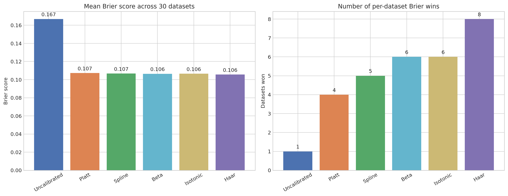
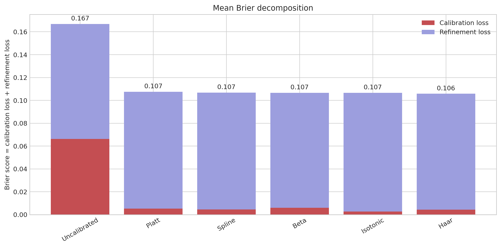
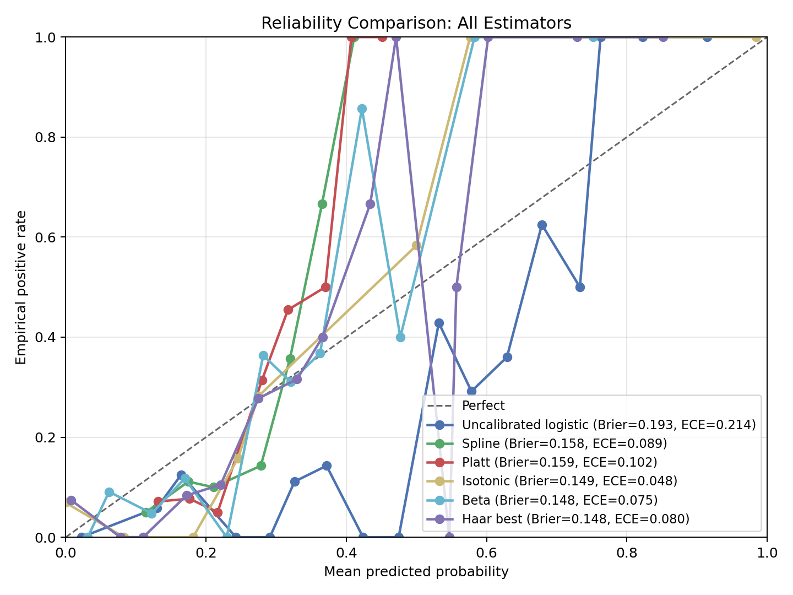
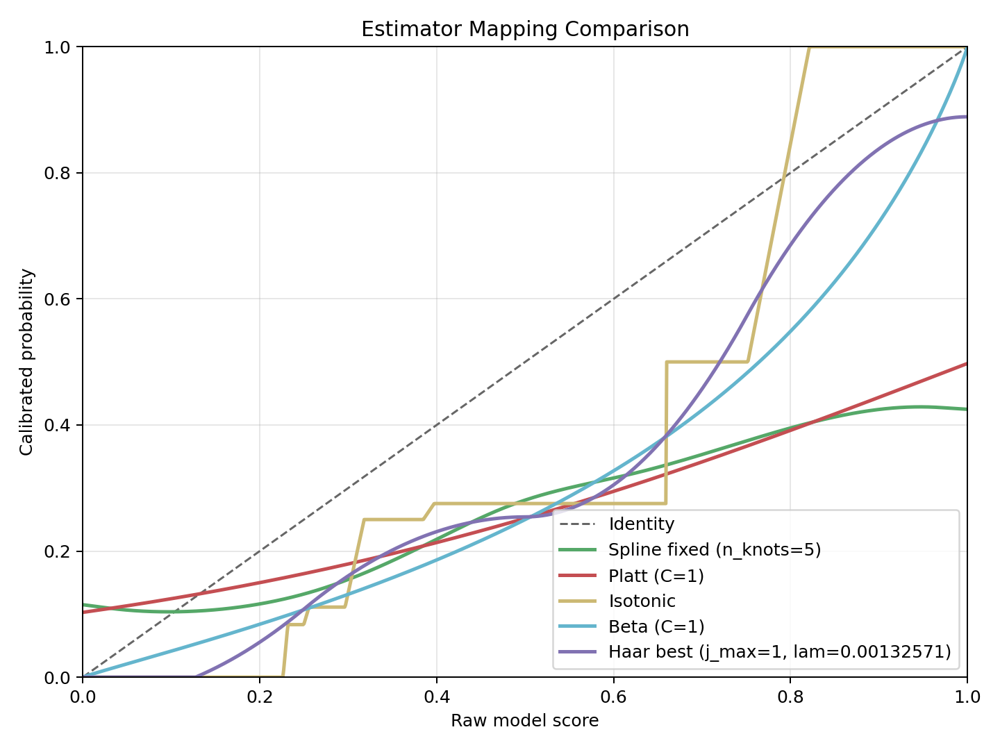
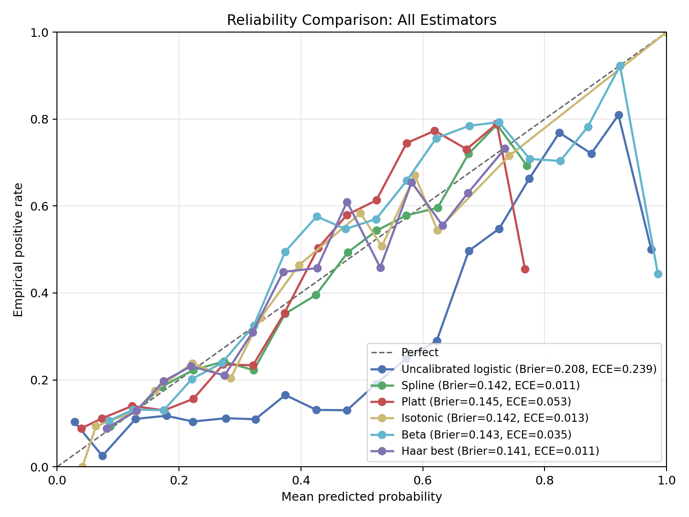
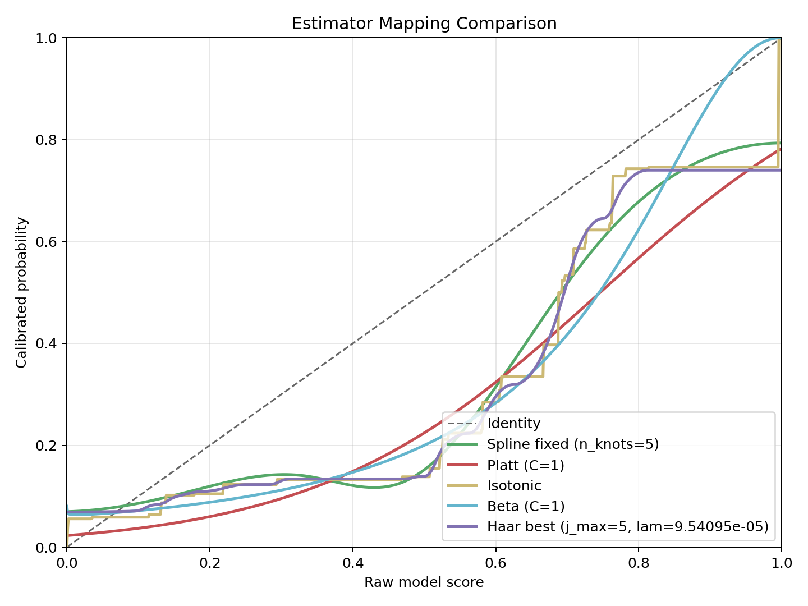

## Thesis Analysis Presentation

**Topic:** Calibration of predictive probabilities for tabular decision support

**Author:** Romans Mosunovs

**Supervisors:** Karlis Zars, MSc; Jonas Moss, PhD

## Why Calibration Matters

- In decision support, a score of `0.80` should behave like an `80%` event rate, not just "high risk".
- Miscalibrated probabilities distort threshold decisions, ranking-based interventions, and cost-sensitive actions.
- This is especially important in finance, healthcare, churn, and failure prediction, where users act on probabilities rather than class labels.
- My thesis focuses on the difficult regime: small or imbalanced tabular datasets, where flexible calibrators may overfit and simple calibrators may underfit.

## Research Question

- Can flexible but constrained post-hoc calibration improve probability reliability on small, imbalanced tabular datasets?
- Comparison set:
  `Uncalibrated logistic`, `Platt`, `Spline`, `Beta`, `Isotonic`, and `Haar`.
- Primary evaluation score:
  `Brier score`, because it is a proper scoring rule and decomposes directly into calibration and refinement.
- Supporting scores:
  `ECE` and `log loss`.

## Post-Hoc Calibration Math {.math-slide}

Raw model probabilities $p$ are mapped to calibrated probabilities $\hat p = f(p)$.

$$
\begin{aligned}
\hat p &= f_{\mathrm{Haar}}(p) \\
&= c + \beta p + \sum_{j=0}^{j_{\max}} \sum_{k=0}^{2^j-1}
\theta_{j,k}\,\tilde{\psi}_{j,k}(p), \\
&\qquad \beta \ge 0,\ \theta_{j,k} \ge 0
\end{aligned}
$$

$$
\begin{aligned}
(\hat c, \hat \beta, \hat \theta)
&= \arg\min_{c,\beta,\theta}
\left\lVert y - c\mathbf{1} - \beta p - B\theta \right\rVert_2^2 \\
&\qquad + \lambda\left(\beta^2 + \lVert \theta \rVert_2^2\right)
\end{aligned}
$$

- Interpretation:
  $f_{\mathrm{Haar}}(p)$ is the post-hoc correction function that maps wrong probabilities to better calibrated ones.
- The nonnegative slope and basis coefficients enforce a monotone mapping.

## Calibration And Refinement {.math-slide}

For the Brier score used in the code and artifacts:

$$
\begin{aligned}
\mathrm{BS}
&= \mathbb{E}\left[(\hat p - Y)^2\right] \\
&= \mathrm{CL} + \mathrm{RL}
\end{aligned}
$$

$$
\begin{aligned}
\mathrm{CL} &= \sum_g w_g(\bar p_g - \bar y_g)^2 \\
\mathrm{RL} &= \sum_g w_g\,\bar y_g(1-\bar y_g)
\end{aligned}
$$

- `CL` is calibration loss: lower means predicted probabilities match observed event frequencies better.
- `RL` is refinement loss: it reflects the remaining uncertainty inside score groups.
- In practice, post-hoc calibration mainly reduces `CL`; it should not create discrimination from nothing.

## Haar, Beta, And Isotonic

- `Isotonic` fits a monotone step function on the raw scores.
- `Haar` is an isotonic-style calibrator with more structure:
  monotone like isotonic, but regularized through a basis expansion and ridge penalty.
- `Beta` is a parametric map based on `log(p)` and `log(1-p)`.
- Inference from the local implementation and artifacts:
  beta is not explicitly constrained to be monotone here, and non-monotone mappings appeared on `3/30` datasets.

## Evaluation Design

- Base learner:
  class-weighted logistic regression with imputation, one-hot encoding, and robust scaling.
- Split:
  stratified `60/20/20` train/calibration/test.
- Haar tuning:
  two-stage `GridSearchCV` on the calibration split with `5` folds and Brier scoring.
- Final outputs used here:
  latest `final_test_metrics.csv`, mapping summaries, and reliability summaries from each dataset run.
- Extra robustness artifact:
  the workflow also stores cross-validated train/test metrics, but the main slides use final test outputs.

## Dataset Scope



## Aggregate Results

:::: {.columns}
::: {.column width="54%"}
{fig-align="center" width=98%}
:::
::: {.column width="46%"}



:::
::::

- On the primary score, `Haar` has the lowest mean Brier (`0.1056`) and the most per-dataset wins (`8/30`).
- `Isotonic` has the lowest mean ECE (`0.0251`).
- `Spline` has the lowest mean log loss (`0.3431`), but only marginally.

## What The Brier Decomposition Shows

:::: {.columns}
::: {.column width="58%"}
{fig-align="center" width=98%}
:::
::: {.column width="42%"}
- Uncalibrated logistic has a much larger mean calibration loss (`0.0663`) than every calibrated alternative.
- All calibrated methods cut mean calibration loss down to roughly `0.0028` to `0.0060`.
- Mean refinement loss stays close to `0.10`, which supports the interpretation that post-hoc calibration mostly fixes reliability rather than changing the underlying signal.
- This is why Brier is the main score in this presentation:
  it links the theory slide directly to the empirical results.
:::
::::

## Focus Case 1: Blood Transfusion Service Center

:::: {.columns}
::: {.column width="50%"}
{fig-align="center" width=98%}
:::
::: {.column width="50%"}
{fig-align="center" width=98%}
:::
::::



- `Haar` has the best Brier (`0.1481`), `beta` the best log loss (`0.4575`), and `isotonic` the best ECE (`0.0475`).
- Interpretation:
  isotonic gives the sharpest local reliability improvement, but its stepwise mapping also pushes log loss up.
- Haar acts like a smoother, more constrained monotone alternative and gives the best primary score here.

## Focus Case 2: Credit Card Clients Default

:::: {.columns}
::: {.column width="50%"}
{fig-align="center" width=98%}
:::
::: {.column width="50%"}
{fig-align="center" width=98%}
:::
::::



- This is the clearest `Haar vs beta vs isotonic` example in the local artifacts.
- `Haar` is best on both Brier (`0.1414`) and log loss (`0.4515`).
- `Beta` is flagged as non-monotone in this run, which supports the practical argument for a monotone constrained calibrator.
- `Isotonic` stays competitive, but the mapping is more stepwise and less structurally constrained.

## Conclusion

- Calibration clearly matters:
  mean Brier drops from `0.1668` uncalibrated to about `0.105` to `0.107` after calibration.
- If the main objective is a proper scoring rule with an interpretable decomposition, `Haar` is the strongest overall result in these artifacts.
- If the main objective is minimal ECE, `isotonic` is often strongest.
- My practical thesis recommendation:
  use `Haar` when monotonicity, regularization, and Brier-focused reliability matter simultaneously, and report `ECE` and `log loss` as sensitivity checks.

## References

- Erickson, N., Purucker, L., Tschalzev, A., Holzmuller, D., Desai, P. M., Salinas, D., & Hutter, F. (2025). *TabArena: A living benchmark for machine learning on tabular data*. arXiv. https://doi.org/10.48550/arXiv.2506.16791
- Kull, M., & Flach, P. A. (2015). *Novel decompositions of proper scoring rules for classification: Score adjustment as precursor to calibration*. In A. Appice et al. (Eds.), *Machine Learning and Knowledge Discovery in Databases* (pp. 68-85). Springer. https://doi.org/10.1007/978-3-319-23528-8_5
- Kull, M., Filho, T. S., & Flach, P. (2017). *Beta calibration: A well-founded and easily implemented improvement on logistic calibration for binary classifiers*. *Proceedings of Machine Learning Research, 54*, 623-631. https://proceedings.mlr.press/v54/kull17a.html
- Mosunovs, R. (2025). *Calibrating predictive models for decision support with flexible methods on small, imbalanced datasets* [Literature review]. BI Norwegian Business School.
- TabArena. (2026). *TabArena - Tabular IID dataset curation repository* [Computer software]. GitHub. https://github.com/TabArena/tabarena_dataset_curation
- Valeman. (2026). *Classifier calibration evaluation framework* [Computer software]. GitHub. https://github.com/valeman/classifier_calibration/tree/release-v1.0
- Van Calster, B., McLernon, D. J., van Smeden, M., Wynants, L., & Steyerberg, E. W. (2019). Calibration: The Achilles heel of predictive analytics. *BMC Medicine, 17*, 230. https://doi.org/10.1186/s12916-019-1466-7

## Appendix: All Dataset Results I



## Appendix: All Dataset Results II



## Thesis Repository

GitHub: [Roman-Mosunov/thesis](https://github.com/Roman-Mosunov/thesis)

Repository link: `https://github.com/Roman-Mosunov/thesis`
